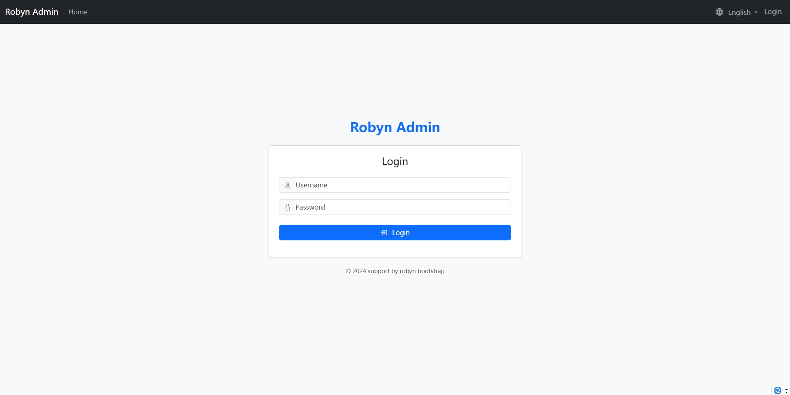

# Robyn Admin

A simple yet powerful admin interface for Robyn framework.

# login page

# model_page

## Finish function
- [x] add admin interface for Robyn framework
- [x] register Tortoise ORM to Admin Modal 
- [x] add filter component in admin
- [x] add language support
- [ ] optimize UI
- [ ] support edit of image upload
- [x] add support for related tables
